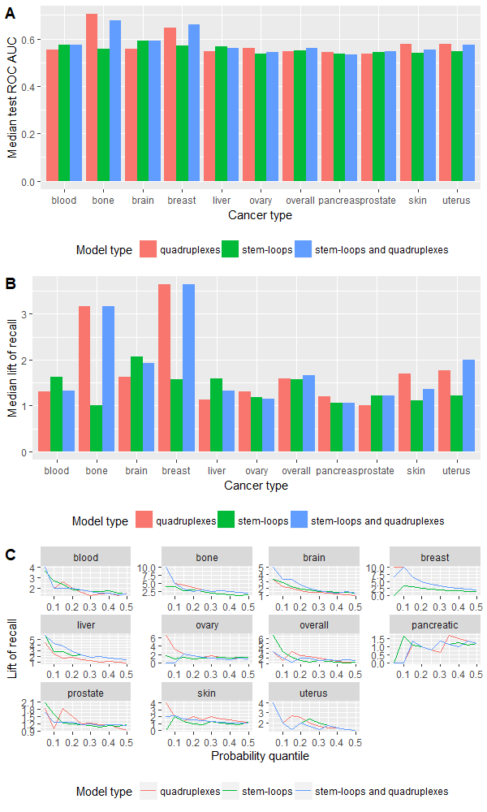

# Cancer breakpoints hotspots prediction

This project contains source code for the paper of [Cheloshkina K., Poptsova M. "Tissue-specific impact of stem-loops and quadruplexes on cancer breakpoints formation"](https://bmccancer.biomedcentral.com/articles/10.1186/s12885-019-5653-x).
The goal of the study is to estimate prediction power of stem-loops and quadruplexes for prediction of cancer breakpoints hotspots.

The reference to source is obligatory if you use code or paper materials.

#### BACKGROUND:
Chromosomal rearrangements are the typical phenomena in cancer genomes causing gene disruptions and fusions, corruption of regulatory elements, damage to chromosome integrity. Among the factors contributing to genomic instability are non-B DNA structures with stem-loops and quadruplexes being the most prevalent. We aimed at investigating the impact of specifically these two classes of non-B DNA structures on cancer breakpoint hotspots using machine learning approach.

#### METHODS:
We developed procedure for machine learning model building and evaluation as the considered data are extremely imbalanced and it was required to get a reliable estimate of the prediction power. We built logistic regression models predicting cancer breakpoint hotspots based on the densities of stem-loops and quadruplexes, jointly and separately. We also tested Random Forest models varying different resampling schemes (leave-one-out cross validation, train-test split, 3-fold cross-validation) and class balancing techniques (oversampling, stratification, synthetic minority oversampling).

#### RESULTS:
We performed analysis of 487,425 breakpoints from 2234 samples covering 10 cancer types available from the International Cancer Genome Consortium. We showed that distribution of breakpoint hotspots in different types of cancer are not correlated, confirming the heterogeneous nature of cancer. It appeared that stem-loop-based model best explains the blood, brain, liver, and prostate cancer breakpoint hotspot profiles while quadruplex-based model has higher performance for the bone, breast, ovary, pancreatic, and skin cancer. For the overall cancer profile and uterus cancer the joint model shows the highest performance. For particular datasets the constructed models reach high predictive power using just one predictor, and in the majority of the cases, the model built on both predictors does not increase the model performance.

#### CONCLUSION:
Despite the heterogeneity in breakpoint hotspots' distribution across different cancer types, our results demonstrate an association between cancer breakpoint hotspots and stem-loops and quadruplexes. Approximately for half of the cancer types stem-loops are the most influential factors while for the others these are quadruplexes. This fact reflects the differences in regulatory potential of stem-loops and quadruplexes at the tissue-specific level, which yet to be discovered at the genome-wide scale. The performed analysis demonstrates that influence of stem-loops and quadruplexes on breakpoint hotspots formation is tissue-specific.

Structure of repository:
- run: all scripts used in paper
    - data_preparation: all scripts for data preparation to get final datasets for building models
    - helper_functions.R: functions for data transformation and building models 
    - train.R: script for model building
    - report.Rmd: R markdown to visualize models performance
    - comparison.Rmd: R markdown to compare all models by visualizing results
- dev: scripts for ad-hoc analysis
- data: all data
   - raw breakpoints: source data from ICGC (International Cancer Genome Consortium) with some intermediate data
   - secondary: raw data of secondary structures
   - preprocessed: preprocessed data in .csv format (by cancer type and aggregation level)
   - data for model: preprocessed data in .R format (one file for each dataset) - input for modeling
   - adhoc: data for ad-hoc analysis
- requirements.txt: list of all packages needed for project
